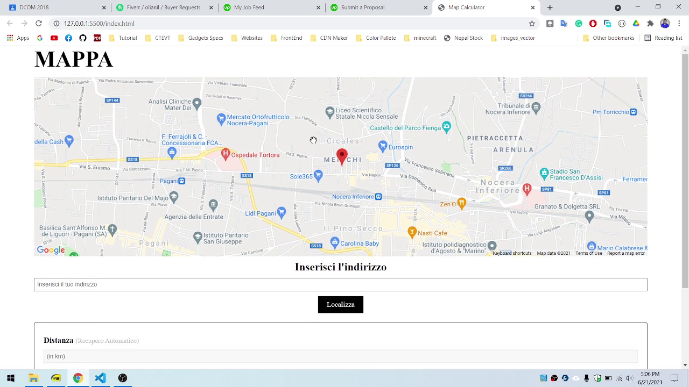

# Map Calculator
This project is for my fiverr client. In this project, I made the calculator where the data is fetch from the distance between the two point in the maps.

In project, I use google maps api. Languege is in italian for my client.

---

## Table Of Contents
- [Technology Used](#technology)
- [API](#api)
- [Features](#features)
- [Demo](#demo)

---

## Technology
- HTML
- CSS
- Javascript

---

## API

I use the google API where the API included are:
- Google Maps Javascript API
- Directions API
- Distance Matrix API
- Places API

---

## Features
- Get direction when click in maps
- Search the location By using search bar
- Autocomplete Place Address which is restricted in Italy in this code
- Auto Reset calculations after 15 seconds.

---

## Demo

### Image

### Video
Demo is in video because the api is restricted for my client and to prevent from unwanted used of api.

Drive Link to See Demo Video: [Click Here](https://drive.google.com/file/d/1zbX0rKTizTlSxkXgJEs7pwuwPnmIwnFe/view?usp=sharing)

---

### Author
- [Linkedin: Anil Oli](https://linkedin.com/in/aniloli)
- [Facebook: Anil Oli](https://facebook.com/anil.oli.4321)

